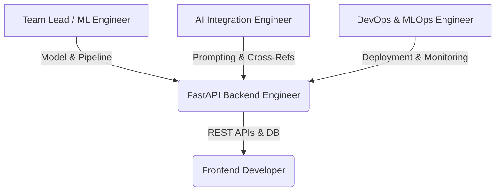

# 👥 Fake News Detector AI: Team Role Delegation Plan

This document defines the roles, responsibilities, code ownership, and technical knowledge required for a 5-person development team to collaborate on, maintain, and scale the Fake News Detector AI application.

---

---

## 1. Lead Machine Learning Engineer (Team Lead / You)
*Responsible for the core predictive engine, feature engineering, and offline training pipelines.*

* **Code Ownership:** 
  * `train.py` (Model training, balancing, tuning, and evaluation)
  * `meta_features.py` (Linguistic, punctuation, and readability feature extraction)
  * `cross_domain_eval.py` (Evaluating robustness against new domains)
* **What You Need to Know:**
  * **Ensemble Architecture:** The core predictor is a 5-model `VotingClassifier` (Logistic Regression, Random Forest, SGD Classifier, LinearSVC, and LightGBM) utilizing soft voting.
  * **Feature Engineering:** Combines a 15,000-dimensional TF-IDF matrix (for text content) with a 20-dimensional scaled metadata matrix (for structural traits like sensationalism score, conspiracy keyword density, and title-case ratios).
  * **Version Sensitivity:** The serialized model artifacts (`models/model.joblib`) are highly sensitive to library versions. Keep Scikit-Learn pinned to `1.8.0` and NumPy to `2.4.4` to avoid deserialization errors.

---

## 2. FastAPI Backend Engineer
*Responsible for server-side logic, user authentication, database management, and API design.*

* **Code Ownership:**
  * `api.py` (Application routes, middleware, rate-limiting)
  * `database.py` (SQLAlchemy schemas, database connections)
  * `app.py` (FastAPI initialization and settings)
* **What You Need to Know:**
  * **Database Integration:** The app supports local development using SQLite and production deployment using PostgreSQL. The schema handles user credentials, analysis logs, and saved articles.
  * **Security & Authentication:** Uses JWT tokens for session verification. Ensure password hashing uses bcrypt and token expiration is enforced.
  * **Rate Limiting:** Employs `slowapi` to protect memory-intensive prediction endpoints (`/api/v1/analyze`, `/api/v1/gemini-verify`, `/api/v1/gnews-search`) from DDoS/scraping attempts.

---

## 3. Frontend Developer (UI/UX)
*Responsible for the client-side user experience, visual credibility scoring, and asynchronous states.*

* **Code Ownership:**
  * `frontend/index.html` (Semantic HTML structure and result containers)
  * `frontend/app.js` (Asynchronous API orchestration and client state)
  * `frontend/style.css` (Premium design system, colors, layout transitions)
* **What You Need to Know:**
  * **Real-time Combined Scoring:** The user dashboard features a 3-source card layout: ML Model, Gemini AI, and GNews API. 
  * **Asynchronous Fetching:** When a user submits an article, the ML Model analysis returns instantly. The frontend initiates parallel async fetch requests to the Gemini verification and GNews search endpoints to dynamically update their progress rings.
  * **Dynamic Verdict Update:** As each API response resolves, the page calls `updateCombinedVerdict()` which recalculates the final score: `(ML * 0.5) + (Gemini * 0.3) + (GNews * 0.2)`.

---

## 4. AI Integration & Prompt Engineer
*Responsible for external cognitive integrations, corroboration logic, and factual verification.*

* **Code Ownership:**
  * `api_client.py` / `src/external/` (Third-party API clients for Gemini and GNews)
  * `api.py` (The prompt generation and GNews keyword logic)
* **What You Need to Know:**
  * **Structured AI Outputs:** The Gemini verification prompt instructs the LLM (`gemini-2.0-flash`) to analyze semantic structure and fact-check assertions, returning structured JSON containing a `credibility_score` (0-1), a categorical `verdict` (e.g., LIKELY_TRUE, LIKELY_FALSE), and detailed reasoning.
  * **Web Corroboration (GNews):** The GNews search extracts up to 5 keywords from the article body. It searches GNews, filters results by domain reputation, and returns a web corroboration score based on the number of trusted sources (e.g., Reuters, BBC) reporting on the topic.

---

## 5. DevOps & MLOps Engineer
*Responsible for continuous deployment, environment configurations, and production model health.*

* **Code Ownership:**
  * `Dockerfile` & `docker-compose.yml` (Containerization)
  * `Procfile` (Render/Heroku start command instructions)
  * `requirements.txt` & `requirements-deploy.txt` (Dependencies)
  * `model_monitor.py` (Checking for model/data drift)
* **What You Need to Know:**
  * **Render Build Cache:** When redeploying dependency-heavy model changes, always deploy using **"Clear build cache & deploy"** to avoid python library conflicts.
  * **Secure Secrets Management:** The application relies on external environment variables:
    * `GEMINI_API_KEY`: API access for the Gemini model.
    * `GNEWS_API_KEY`: API access for GNews queries.
    * `DATABASE_URL`: Connection string for Postgres database.
  * **Model Monitoring:** Runs `model_monitor.py` regularly to check for prediction drift (comparing recent predictions against actual user corrections) and system health.
